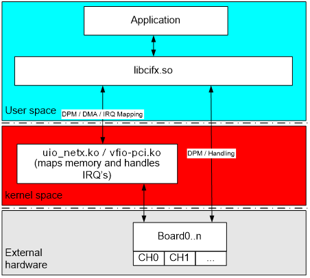
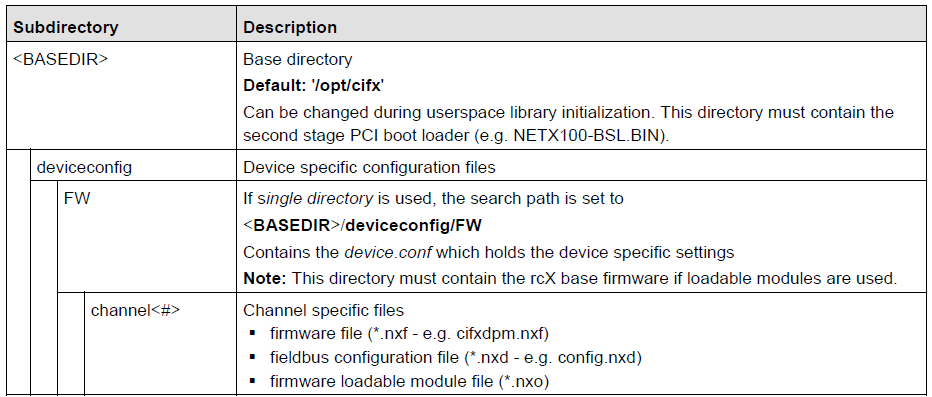

# Overview

This repository provides the following components:

| component                                                | license       | description
| ----------------------------------------                 |:-------------:|:-------------:|
| [libcifx](libcifx/)                                      | [MIT](libcifx/LICENSE.md)                | User space driver for cifX/netX devices ([more information](https://hilscher.atlassian.net/l/cp/JFCHnF6h)).
|  - [cifX toolkit](libcifx/Toolkit/)                      | [SLA](libcifx/Toolkit/LICENSE.md)        | OS independant device handling abstraction of netX devices. It is referenced by the user space library ([more information](https://hilscher.atlassian.net/l/cp/bBwTb2Wc)).
| [uio_netx](uio_netx/)                                    | [GPLv-2-only](uio_netx/LICENSE.txt)      | kernel mode driver (required for memory mapped devices)
| [ax99100](cifx_m2/)                                      | [GPLv-2-only](cifx_m2/LICENSE.txt)       | kernel mode driver (requried for cifX M.2 devices)
| [cifX examples](examples/)                               | [MIT](LICENSE.md)                        | cifX driver example applications (API, TCP server).
|  - [marshaller toolkit](examples/tcpserver/Marshaller/)  | in clarification                         | OS independant implementation of the netXtransport protocol device(/server) side. It is referenced by the TCP server ([more information](https://hilscher.atlassian.net/l/cp/e4W3zr1Y)).


# Driver architecture



The Linux cifX driver provides support of multiple devices of the [cifX product portfolio](https://www.hilscher.com/products/pc-cards-for-industrial-ethernet-fieldbus).
The driver consists of a user space and a kernel space component. Depending on your hardware both or only the user space component will be required.

| hardware                       | libcifx           | uio_netx      | ax99100
| ------------------------------ |:-----------------:|:-------------:|:-------------:|
| PCI based host interface       | (x)               | (x)           | (-)
| SPI based host interface       | (x)+(SPM_PLUGIN)  | (-)           | (-)
| ISA or other memory mapped     | (x)               | (optional)    | (-)
| cifX M.2 device                | (x)+(SPM_PLUGIN)  | (-)           | (x)

Note that this documentation currently provides only a short overview. It will be updated step by step. Transitionally refer to the [superseded driver's documentation](doc/OBSOLETE-cifX-Device-Driver-Linux-DRV-15-EN.pdf). Commands mentioned there
may not work 1:1 since the driver's folder structure changed but it provides background information and still some valid hints.

Note: When the PCI interface is not required remember to disable it. Only then the libcifx's dependency to libpciaccess-dev library will be removed (see "DISABLE_PCI", Manual driver installation).

For SPI support use the driver's SPM plugin. It provides an easy integration for SPI devices. The plugin need to be enabled during build, since it's disabled by default.
<pre>


</pre>
# Requirements

 - CMake (min 2.8.12)
 - Linux kernel header (only required when building the kernel module uio_netx)
 - libpciaccess-dev (only required for PCI devices)
 - libpthread, librt
 - libnl-3/libnl-cli-3 (only required when VIRTETH is enabled)

```
sudo apt-get install cmake
```
```
sudo apt-get install linux-headers-$(uname -r)
```
```
sudo apt-get install libpciaccess-dev
```
```
sudo apt-get install libnl-3-dev libnl-cli-3-dev
```
<pre>


</pre>
# Simple driver installation in one step

You can run the driver installation by simply executing the script 'build_and_install_driver'.

Enter the directory containing the script 'build_and_install_driver' execute it and follow the instructions (root during installation requested)
```
./build_install_driver
```

In case a more advanced setup is required or any installation trouble run the setup step by step.
<pre>


</pre>
# Manual driver installation

## Build of the user space library libcifx

1. create a build folder and enter it
```
mkdir drv_build; cd drv_build
```
2. Prepare the build environment via cmake call and pass the path to the driver's lists file (CMakelists.txt within libcifx folder).
Run the preparation with your required options e.g. enable debug messages:
```
cmake ../ -DDEBUG=ON
```

All possible options are listed here:

| parameter                      | description   |
| ------------------------------ |:-------------:|
| DEBUG                          | Build with debug messages enabled.
| DISABLE_PCI                    | Disable PCI support. This will remove all links to libpciaccess.
| DMA                            | Enables DMA support.
| HWIF                           | Enables support for custom hardware interface.
| NO_MINSLEEP                    | Disables minimum sleep time. If “on” the driver may “wait active” (no call to pthread_yield()).
| SPM_PLUGIN                     | Enables support for SPI devices (spidev framework).
| TIME                           | Enables toolkit function, setting the device time during device start-up.
| VIRTETH                        | Enables support for the netX based virtual Ethernet interface. Note: This feature requires dedicated hardware and firmware.
| SHARED                         | Switch between shared and static library.

3. build and install the driver
```
make; sudo make install
```
<pre>

</pre>
## Build of the kernel space driver uio_netx

1. Enter the module's source folder uio_netx and run make.
```
make
```
2. Then install the module according to your system's setup and update the module dependencies e.g:
```
sudo cp uio_netx.ko /lib/modules/$(uname -r)/kernel/drivers/uio/
sudo depmod
```
<pre>


</pre>
# System and hardware setup

## System configuration
Depending on your system's setup only privileged users may be allowed to access the hardware.

### PCI host interface

To be able to access the a PCI card as an unprivileged user use the provided udev rule (templates/udev/80-udev-netx.rules).
Make sure to load the kernel module before running the test application. Otherwise no hardware will be created an therefore the access fail.
In case your kernel provides already the mainline uio_netx module. Make sure to unload this before to run latest version of it.
To load the kernel module run the following line.
```
sudo modprobe uio_netx
```

To unload the kernel module run the following line.
```
sudo modprobe -r uio_netx
```

<pre>

</pre>
### SPI host interface

To be able to access a SPI device make sure to allow read/write access to the SPI interface (e.g. /dev/spidev0.0).
The SPI plugin default configuration is stored under "/opt/cifx/plugins/netx-spm/config0". Make sure to update the configuration as required.

| parameter      |               |
| -------------- |:-------------:|
| Device         | Name of the SPI device to open (e.g. /dev/spidev0.0 -> Device=spidev0.0)
| Speed          | Maximum speed to configure the driver (e.g. 25Mhz -> Speed=25000000)
| Mode           | SPI mode 0 to 3

<pre>

</pre>
## Hardware configuration
Depending on the hardware we need to prepare the host system to be able to access the hardware. Flash based devices may not require any system setup to run a simple demo application.
In contrast to that a RAM based device like the common cifX PCIe hardware, the driver need to download at least a second stage loader to run a simple test application. 
For more advanced API tests a firmware and dedicated firmware configuration file is required.

The driver uses a simple folder structure to store the bootloader and firmware for each hardware. The driver supports four different methods of how to identify the devices and handling their firmware and configuration assignments.
In the following the most simple (at the expense of the support of multiple devices at a time) called "single directory" is explained.



This folder structure can be created by using the provided script. The script also installs the required boot loader.
Enter the script folder and install the boot loader and create the required folder structure.
```
./install_firmware install
./install_firmware create_single_dir
```

The script should have now created the base directory "/opt/cifx/" with the subfolders "deviceconfig", "deviceconfig/FW" and "deviceconfig/FW/channel0". Further it should have installed the boot loader within the base directory.

When running now an example application a small set of tests will work. For an advanced test copy the correct firmware and it's configuration into the 'channel0' folder within the configuration directory.

<pre>


</pre>
# Build of the provided example applications
1. create a build folder and enter it
```
mkdir demo_build; cd demo_build
```
2. Prepare the build environment via cmake call and pass the path to the examples lists (CMakelists.txt within examples folder) file.
Run the preparation with your required options e.g.:
```
cmake ../examples/ -DDEBUG=ON
```
3. Build the examples. And run a demo application. Note that you may need root rights. This depends on your system setup. For more information see "System and hardware setup".
```
make
./cifxapi
```
